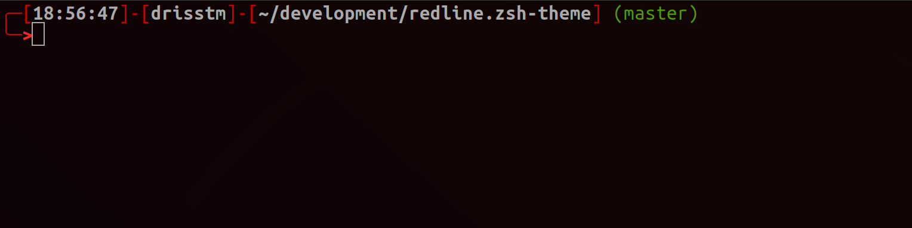

# redline.zsh-theme
<br/>

## Installation
```bash
curl -s https://raw.githubusercontent.com/DrissTM/redline.zsh-theme/master/redline.zsh-theme > ~/.oh-my-zsh/themes/redline.zsh-theme
```
<br/>

## Screenshot

